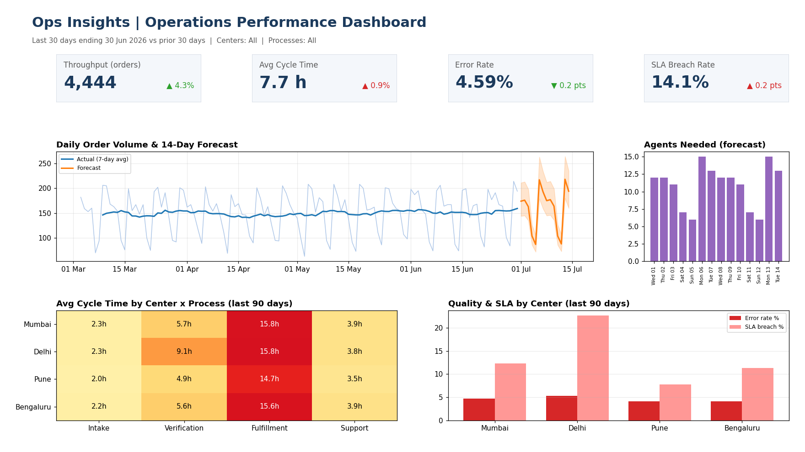
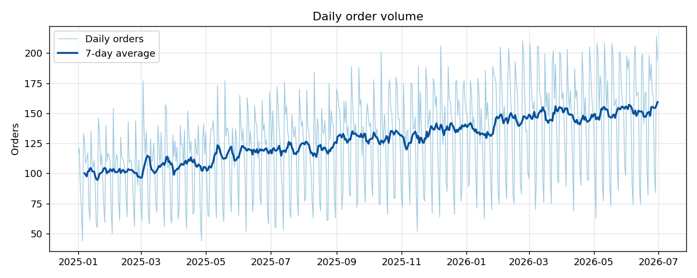
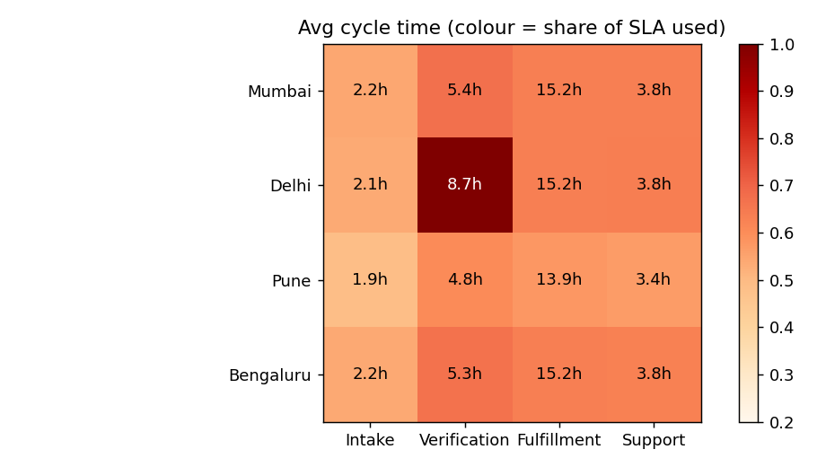
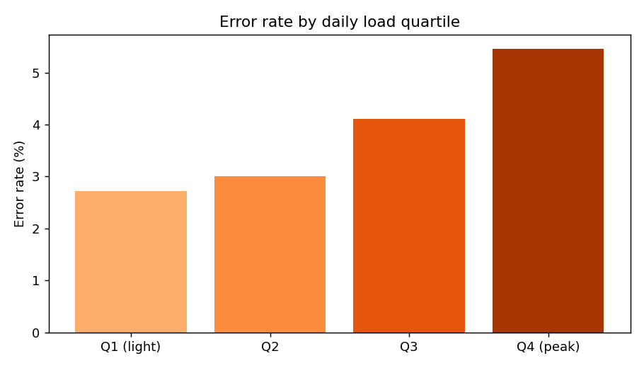
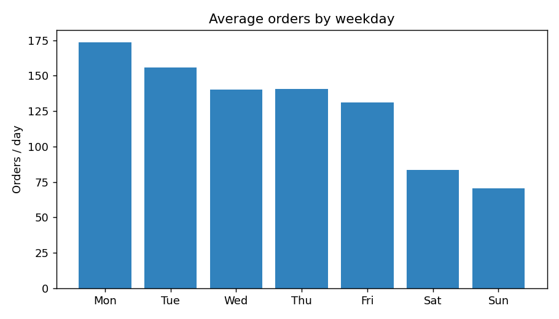
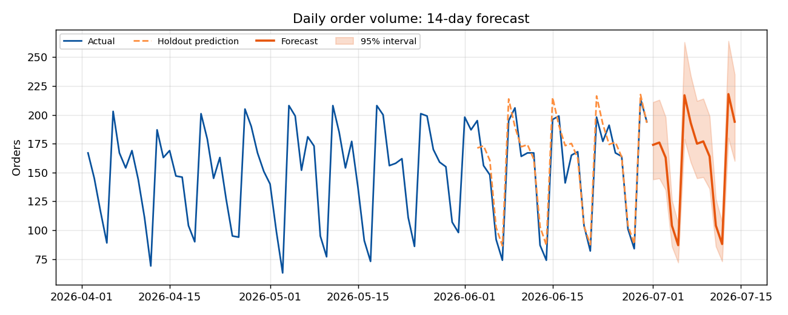

# Ops Insights: Operations Analytics & Predictive Dashboard

End-to-end operations analytics project: ingest data from two source systems, validate and clean it, define core KPIs in SQL, explore bottlenecks, forecast near-term volume for staffing, and publish a Tableau / Power BI dashboard with a plain-language summary.

**Tech stack:** Python (pandas, scikit-learn, matplotlib) | SQL (SQLite) | Tableau | Power BI | EDA | Predictive analytics

> **Note on data:** the dataset is **synthetic**, generated by `src/generate_data.py` with realistic patterns and deliberately injected data-quality problems, so the project is fully reproducible without sharing real operational data.

## Dashboard



*KPI cards (throughput, cycle time, error rate, SLA breach) with change vs the prior 30 days, a 14-day volume forecast with 95% interval, forecast staffing needs, a center x process cycle-time heatmap, and quality by center. Build steps: [`tableau/BUILD_GUIDE.md`](tableau/BUILD_GUIDE.md).*

## Key Findings

| # | Finding |
|---|---|
| 1 | Daily volume grew **~46%** (103 to 150 orders/day, first vs last 90 days) |
| 2 | **Delhi Verification** is the bottleneck: 8.7h avg vs 5.2h at other centers, **48% SLA breach** |
| 3 | Error rate nearly **doubles on peak-load days** (2.7% to 5.5%) |
| 4 | **Monday backlog** adds ~1.3h to average cycle time |

Details: [`docs/eda_findings.md`](docs/eda_findings.md) | Stakeholder version: [`docs/stakeholder_summary.md`](docs/stakeholder_summary.md)

| Volume trend | Cycle-time heatmap |
|---|---|
|  |  |
| **Error rate vs load** | **Weekday pattern** |
|  |  |

## Pipeline

```
 System A (CSV, ISO dates)  ─┐
                             ├─> stg_operations ─> SQL quality checks ─> cleansing rules ─> fact_operations
 System B (CSV, dd/mm/yyyy) ─┘                                                     └─> rejected_records
                                                                                   │
                                   vw_daily_kpis (SQL KPI definitions) <───────────┘
                                        │
              ┌─────────────────────────┼──────────────────────────┐
              ▼                         ▼                          ▼
        EDA charts            Regression forecast        Tableau / Power BI exports
```

### 1. Data collection & validation
- Two sources with different schemas, date formats, and status codes are harmonized into one staging table (`src/clean.py`).
- Seven SQL quality checks ([`sql/02_quality_checks.sql`](sql/02_quality_checks.sql)) run before cleaning and produce [`docs/data_quality_report.md`](docs/data_quality_report.md).

| Check | Rows flagged |
|---|---:|
| Duplicate order IDs | 707 |
| Completed but no completion time | 548 |
| Completion before creation | 209 |
| Cycle time > 72h | 69 |
| Missing units | 356 |
| Non-canonical center labels | 3,575 |

Cleansing rules: standardize center labels, de-duplicate, reject impossible/missing timestamps and extreme cycle times, impute missing units with the process median (flagged). **71,388 raw rows to 69,867 clean rows (2.13% rejected)**; every rejection is logged with a reason in `rejected_records`.

### 2. KPI definitions ([`sql/03_kpi_views.sql`](sql/03_kpi_views.sql))
| KPI | Definition |
|---|---|
| Throughput | Completed orders (and units) |
| Cycle time | Avg hours from creation to completion, completed orders only |
| Error rate | Orders with an error / completed orders |
| SLA breach rate | Orders over their process SLA / completed orders |

The view stores additive counts only. Ratios are derived from sums in Python, Tableau (`tableau/BUILD_GUIDE.md`) and Power BI (`powerbi/measures.dax`), so numbers stay **consistent across every view and tool**.

### 3. Predictive model ([`src/forecast.py`](src/forecast.py))
Log-linear regression on a time trend and day-of-week (multiplicative seasonality), evaluated on a 28-day time-based holdout.

| Model | MAE (orders/day) | MAPE |
|---|---:|---:|
| Regression | 11.2 | 7.9% |
| Naive (same weekday last week) | 12.1 | 8.4% |

The 14-day forecast (with 95% interval) is converted to **agents needed** using historical productivity (~15.3 orders per agent per day). Output: `data/tableau/forecast.csv`.



*Limitations: no holiday/promotion features and a single linear trend. Next steps are listed below.*

## Project Structure

```
ops-insights/
├── src/                  # Python pipeline (run_pipeline.py is the entry point)
├── sql/                  # schema, data-quality checks, KPI view
├── tableau/              # dashboard build guide + calculated fields
├── powerbi/              # DAX measures
├── data/tableau/         # BI-ready CSV exports (committed)
├── docs/                 # reports, findings, stakeholder summary, images
└── tests/                # data integrity tests
```

## Run It

```bash
git clone https://github.com/<your-username>/ops-insights.git
cd ops-insights
pip install -r requirements.txt
python src/run_pipeline.py     # generates data, builds DB, reports, charts, exports
pytest tests                   # data integrity tests
```
Then open the CSVs in `data/tableau/` in Tableau or Power BI and follow the guides.

## Future Improvements
- Add holiday/promo features, or compare against Prophet / gradient boosting
- Forecast per center to drive center-level rosters
- Schedule the pipeline (Airflow / cron) and publish the workbook to Tableau Server / Power BI Service
- Alerting when SLA breach rate crosses a threshold
